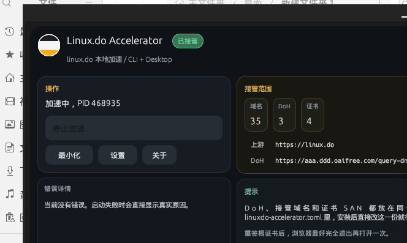

# Linux.do Accelerator

<div align="center">
  
  <h1>Linux.do Accelerator</h1>
  <p>一个原生 Rust 的 <code>linux.do</code> 专属加速器，提供 <b>CLI + 桌面 GUI</b> 双形态。</p>

  <p>
    
    
    
    
  </p>
</div>

<p align="center">
  
</p>

## Overview

`linuxdo-accelerator` 的目标很直接：

- 一键生成并安装本地根证书
- 一键写入和清理 `hosts`
- 本地监听 `80/443`
- 为 `linux.do` 及其子域提供本地接管和转发
- 同时支持脚本场景下的 `CLI`，以及普通用户可双击使用的桌面 GUI

## Highlights

- 原生 Rust 实现，不依赖 Node 运行时
- GUI 与后台代理逻辑分离，窗口关闭或最小化后后台仍可继续工作
- 支持系统提权，适合证书安装、`hosts` 写入和低端口监听
- 配置项集中在单个 `linuxdo-accelerator.toml`
- 三端统一思路：
  - Windows：双击打开 `.exe`
  - Linux：安装 `.deb` 后桌面启动
  - macOS：拖入 `Applications` 后直接打开

## GUI

桌面端默认提供：

- `开始加速 / 停止加速`
- 一键最小化
- 错误详情展示
- 当前上游、DoH、证书和域名接管范围预览
- 配置和关于面板

平台行为：

- Windows：支持托盘最小化与恢复
- Linux：Wayland / GNOME 下使用托盘代理恢复窗口
- macOS：支持最小化到 Dock，已接入菜单栏图标恢复链路

## Quick Start

初始化默认配置：

```bash
cargo run --bin linuxdo-accelerator -- init-config
```

准备证书和 `hosts`：

```bash
sudo cargo run --bin linuxdo-accelerator -- setup
```

前台直接启动：

```bash
sudo cargo run --bin linuxdo-accelerator -- start
```

停止后台加速：

```bash
sudo cargo run --bin linuxdo-accelerator -- stop
```

查看当前状态：

```bash
cargo run --bin linuxdo-accelerator -- status
```

直接打开 GUI：

```bash
cargo run --bin linuxdo-accelerator
```

## Configuration Paths

默认情况下，程序只使用一个主配置文件 `linuxdo-accelerator.toml`。

| 平台 | 主配置文件 | 运行状态目录 | 证书目录 |
| --- | --- | --- | --- |
| Linux | `~/.config/linuxdo-accelerator/linuxdo-accelerator.toml` | `~/.local/share/linuxdo-accelerator/runtime` | `~/.local/share/linuxdo-accelerator/certs` |
| Windows | `%APPDATA%\linuxdo\linuxdo-accelerator\config\linuxdo-accelerator.toml` | `%LOCALAPPDATA%\linuxdo\linuxdo-accelerator\data\runtime` | `%LOCALAPPDATA%\linuxdo\linuxdo-accelerator\data\certs` |
| macOS | `~/Library/Application Support/io.linuxdo.linuxdo-accelerator/linuxdo-accelerator.toml` | `~/Library/Application Support/io.linuxdo.linuxdo-accelerator/runtime` | `~/Library/Application Support/io.linuxdo.linuxdo-accelerator/certs` |

如果显式指定：

```bash
linuxdo-accelerator --config /path/to/linuxdo-accelerator.toml
```

程序会改用该配置文件；对应的 `runtime` 和 `certs` 目录也会优先跟着这个配置目录走。

## Config Example

```toml
listen_host = "127.0.0.1"
hosts_ip = "127.0.0.1"
http_port = 80
https_port = 443
upstream = "https://linux.do"
proxy_domains = ["linux.do", "www.linux.do"]
certificate_domains = ["linux.do", "www.linux.do", "*.linux.do"]
ca_common_name = "Linux.do Accelerator Root CA"
server_common_name = "linux.do"
```

当前项目把以下内容统一放在同一个配置文件中：

- DoH 上游
- 接管域名列表
- 证书 SAN 域名列表
- 监听地址和端口

## Binaries

项目包含两个可执行文件：

- `linuxdo-accelerator`
  - CLI 主入口
  - 负责 `setup / start / stop / status` 等命令
- `linuxdo-accelerator-ui`
  - 桌面 GUI 入口
  - Windows 下双击打开弹窗
  - Linux 下可由 `.desktop` 启动
  - macOS 下打包为 `.app / .dmg`

## Packaging

项目使用 [`cargo-packager`](https://github.com/crabnebula-dev/cargo-packager) 和 [`Packager.toml`](./Packager.toml)：

- Windows：`NSIS .exe`
- Linux：`.deb`
- macOS：`.dmg`

本地打包：

```bash
cargo install cargo-packager --locked
cargo packager --release -c Packager.toml
```

只打 Linux `deb`：

```bash
cargo packager -f deb --release -c Packager.toml
```

## GitHub Actions

macOS 不再走本地交叉编译脚本，而是通过 GitHub Actions 原生构建：

- Linux runner：生成 `.deb`
- Windows runner：生成 `NSIS .exe`
- macOS runner：生成 `.dmg`

相关工作流见：

- [`.github/workflows/build-release.yml`](./.github/workflows/build-release.yml)

## Current Scope

当前定位仍然比较明确：

- 站点专属本地接管，不是系统全局代理
- 以 `HTTP / HTTPS` 为主
- 侧重 `linux.do` 及其关联域名

## Development Notes

本项目已经完成并验证过的关键点：

- Linux Wayland / GNOME 下的最小化和恢复
- Windows 托盘恢复、图标打包和无黑框提权
- macOS 本机编译与窗口最小化恢复链路
- 证书、`hosts` 和运行状态文件统一管理

## Inspirations

- [docmirror/dev-sidecar](https://github.com/docmirror/dev-sidecar)
- `steamcommunity302`
- [groupultra/telegram-search](https://github.com/groupultra/telegram-search)
